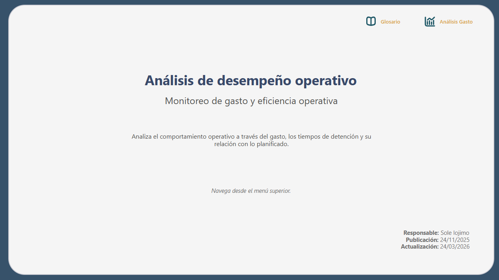
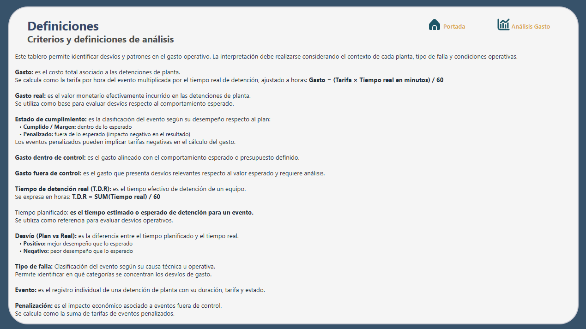
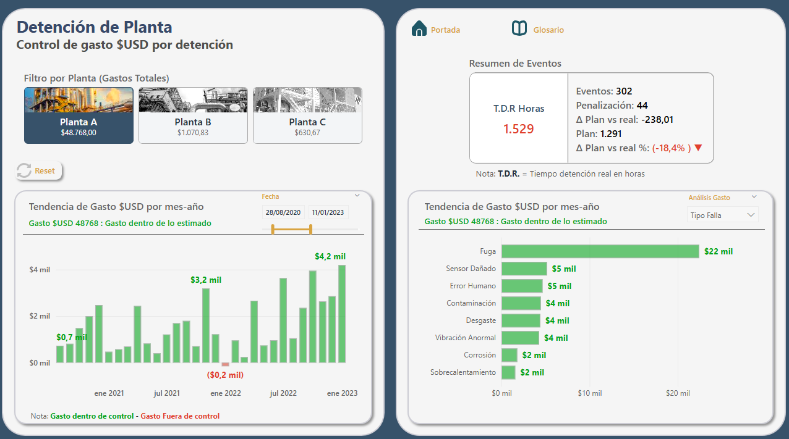
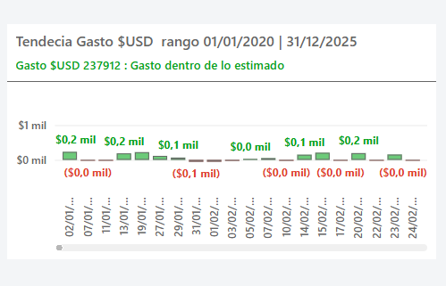
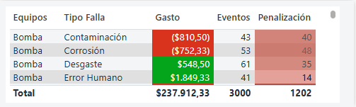

# Industrial Operations Analytics

## Análisis de Desempeño Operativo

Todo empieza con una pregunta simple: ¿dónde se está yendo el dinero y por qué?

Este dashboard en Power BI traduce la operación en información clara, conectando gasto, tiempos de detención y desvíos para facilitar el análisis y la toma de decisiones.

---

## Enfoque del análisis

El tablero está diseñado desde una perspectiva de negocio, permitiendo:

- Identificar gasto dentro y fuera de control
- Analizar desvíos entre tiempo real y planificado
- Detectar patrones por tipo de falla, evento y responsable
- Priorizar focos críticos de mejora operativa

---

## Métricas clave

- Gasto total
- Gasto dentro vs fuera de control
- Tiempo de detención real (T.D.R)
- Tiempo planificado
- Desvío (Plan vs Real)
- % de desvío
- Eventos penalizados

---

## Tecnologías utilizadas

- Power BI
- DAX
- Power Query

---

## Diseño y experiencia de usuario

El dashboard fue diseñado bajo principios de claridad y foco analítico:

- Jerarquía visual clara (título → contexto → datos)
- Uso de color para interpretación inmediata (verde / rojo)
- Subtítulos dinámicos para contexto en tiempo real
- Tooltips enriquecidos para análisis exploratorio
- Navegación simple y consistente entre secciones

---

## Vista previa

### Portada

### Glosario

### Análisis de gasto

### Tooltips

---

## Cómo usar el dashboard

1. Navegar entre secciones desde el menú superior
2. Utilizar filtros para explorar distintas dimensiones (planta, tipo de falla, responsable)
3. Analizar desvíos y su impacto en el gasto operativo
4. Profundizar mediante tooltips y visualizaciones complementarias

---

## Consideraciones

Los datos han sido anonimizados y adaptados con fines demostrativos.

El objetivo del proyecto es evidenciar habilidades de análisis, modelado y visualización, sin representar una industria específica.

## Autor

Sole Iójimo  
Data Analyst | Business Intelligence
